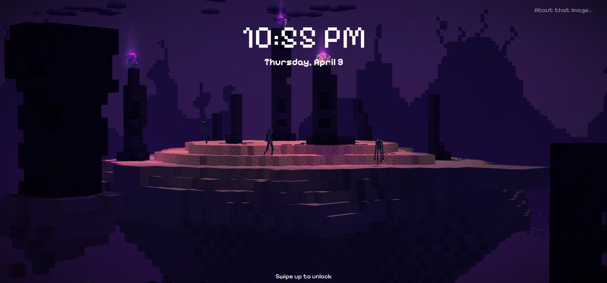
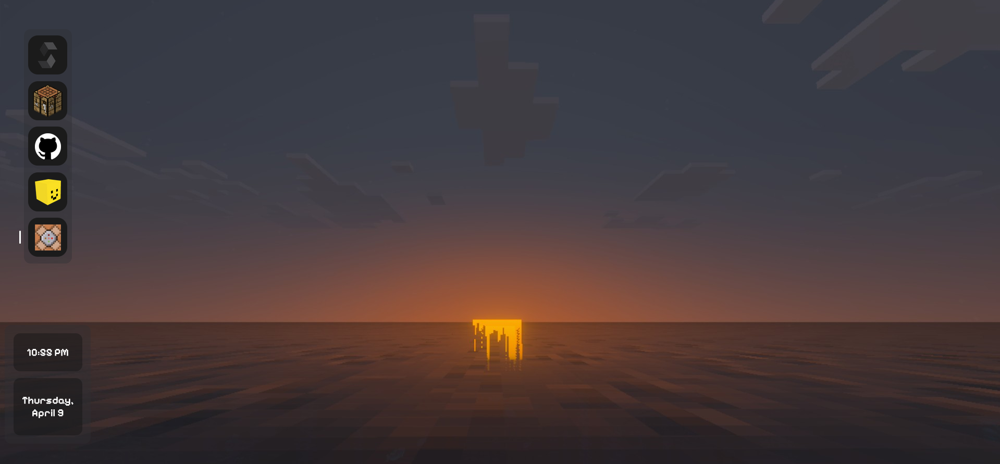

# NetherOS

> A Minecraft-flavored WebOS. Somewhere between Windows and macOS, but blockier.

---

## What is this?

NetherOS is a web-based operating system built with pure HTML, CSS, and JavaScript. It's got a lock screen with PIN login, animated transitions, a desktop with a window system and apps, and randomized wallpapers. Inspired by Windows and macOS, but with that Minecraft aesthetic we all grew up with.

---

## Preview

## Features so far

### Login Screen

- 🕐 Live clock & date on the lock screen

- 🔒 PIN-protected login

- 🖼️ Random wallpaper on each load

- 👆 Swipe up (or hit `Space`) to unlock

- 🎨 Smooth animations and transitions

- ⛏️ Minecraft font, because of course ;3

### Desktop

- Taskbar like in MacOS

- Notification System

- #### Apps
    - Solid Browser (My previous project) - browser

    - CraftCode - Alternative to VS Code (currently supports running Rust code only)

    - Source - view the project source directly inside the OS

    - Settings App - appearances and wifi configurations!

    - Sandbox Environment - not optimised yet, but should work like virtual environment!

    - App Injector - import your own app by link. ( Unfortunately browsers block that function :( )

    - CraftShell - minecraft-styled terminal shell

- Special Effects.

- Window System.

- Date and Time system.

- PowerFind - find any app in your system!

- Minimize, full screen mode and close button for apps

---

## How to run

Just open `index.html` in your browser. That's it. Seriously..... 😭
or just open [direct link](https://vova-professor.github.io/NetherOS/)

---

## What's NEW?
- **Added Terminal** - minecraft-style terminal CraftShell.

---

## Credits
Wallpapers belong to their original authors -> links are in the top-right corner of the lock screen and settings app.